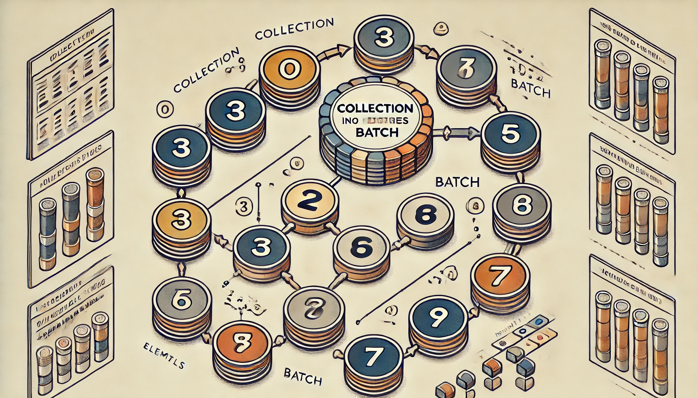
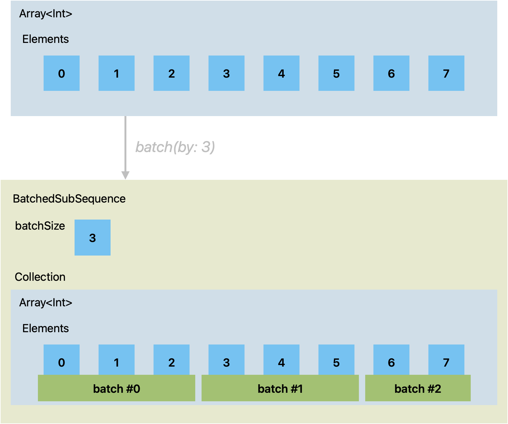

# BatchedCollection - Form Batches from Swift Collection types

**BatchedCollection** is a Swift library that allows you to form batches. These batches have a set maximum count of consecutive elements. The library works with all Swift collection types.

A batch is a group of consecutive elements from the collection. The batch has a given maximum size.

    
    <em>
     
    ChatGPT prompt: A detailed flow-diagram style image showing a collection being split into batches. The collection contains elements 0 until 7. Numbers 0 to 2 go into the first batch, numbers 3 to 5 go into the second batch, numbers 6 and 7 go into the third batch. Numbers are rendered in a circle and each batch is captured in a square box. The color theme is toned down and apt for technical / api documentation.
    </em>

## Key Features

* Efficient O(1) implementation
* Simple API
* Supports all Swift collection types

## Installation

Add the following to your `Package.swift` file:

    dependencies: [
        .package(url: "https://github.com/berikv/BatchedCollection.git", from: "0.0.2")
    ]

## Usage

### Basic example

Form batches from an array:

    let batched = Array(0..<7).batched(by: 3)
    
    print(Array(batched[0])) // prints "[0, 1, 2]"
    print(Array(batched[1])) // prints "[3, 4, 5]"
    print(Array(batched[2])) // prints "[6]"

### Practical example

Imagine writing a fair simulator where the carousel only allows **34 visitors at a time**. You can batch the visitors into groups of 34:

    while parkIsOpen {
        let visitors = await getQueuedCarouselVisitors()
        for batch in visitors.batched(by: 34) {
            await carousel.clear()
            await carousel.board(batch)
            await carousel.run()
        }
    }

To make this work, `carousel.board()` accepts a collection of visitors:

    extension Carousel {
        func board(_ passengers: some Collection<Visitors>) async { ... }
    }

### Detailed Explanation

The `batched(by:)` function extends collection types to split their elements into batches of a specified size. This is particularly useful when processing large collections in chunks to optimize performance or to meet certain constraints. The return type of `batched(by:)` is a BatchedSubSequence, which itself is a collection of Collection.SubSequence of the original collection:

    
    <em>
     
    Memory layout of a BatchedSubSequence consists of an integer to hold the batch size, followed by the memory of the underlying collection.
    </em>

### O(1) Implementation

The implementation of batched(by:) is highly efficient, with O(1) complexity for creating the BatchedSubSequence.
Together with Swifts zero-cost abstraction, this means that `.batched(by:)` is theoretically as efficient as it can be!

## Contribution

Contributions are welcome!

## License

You are free to use this software (see License.md).
I would appreciate it if you let me know if this was useful for you.
